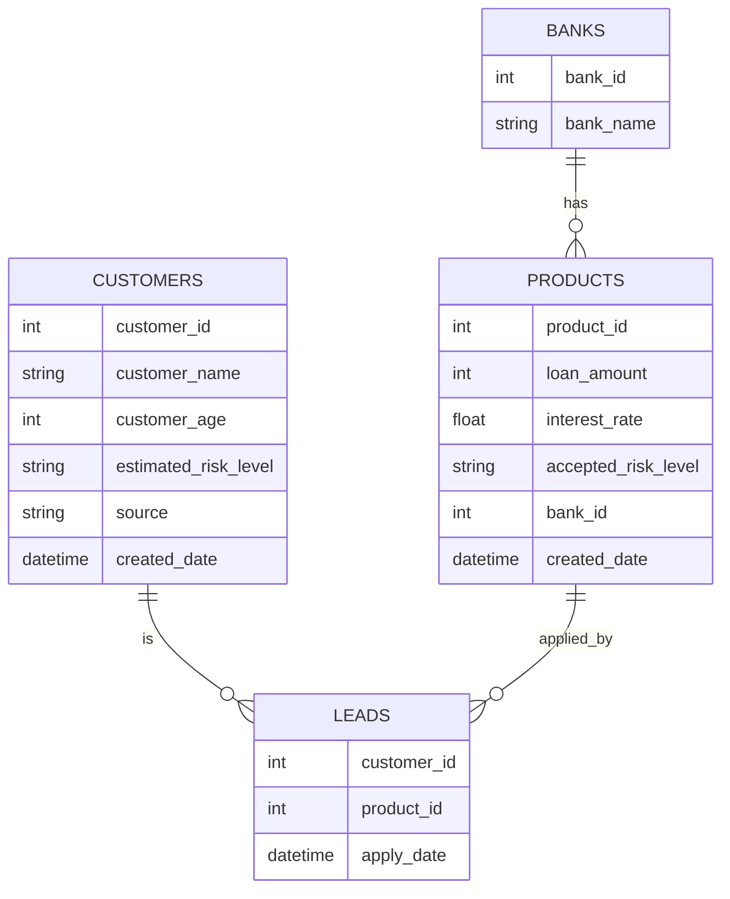

# Trustingsocial data analyst entry test

Go to [this shared folder](https://app.box.com/s/k3bzs7ppesi78u26sub7cuhrlug1n60a) to access the test provided by the company.  This folder consists of pdf test case and related csv files for data.

Topic covered by test:
- Question 1: SQL
- Question 2: Business case study
- Question 3: Data cleaning using python

## Q1

Data schema:
- BANKS - PRODUCTS: relationship 1:n
    - a bank can have 0 or many products
    - a product must belong to only one bank
- CUSTOMERS - PRODUCTS: relationship m:n
    - a customer has interest into one or many products
    - a product can also be applied by one or many customers
- LEADS: the bridge table that hold the relation between CUSTOMERS and PRODUCTS tables



Copy this [gist](https://gist.github.com/h7b/01666b7c4fdbf4667be5664f11eb4f0a#file-20230313-trustingsocial-sql-create-sql) into [db-fiddle](https://www.db-fiddle.com/) "Schema SQL" pane to create the sample data tables. Then choose "Database" as "MySQL v8.0". Start to fiddle the SQL.

The query use Mysql v8.0 engine.

### 1a

Q: Show the number of products available for each accepted risk level

A:

```sql
SELECT accepted_risk_level, COUNT(*) AS num_products
FROM products
GROUP BY accepted_risk_level;
```

### 1b

Q: Show the average interest rate of products provided by HSBC bank

A:

```sql
SELECT AVG(interest_rate) AS avg_interest_rate
FROM products p
INNER JOIN Banks b ON p.bank_id = b.bank_id
WHERE b.bank_name = 'hsbc';
```

### 1c

Q: Show 2 banks that have most high risk products

A:

```sql
SELECT b.bank_name, COUNT(*) AS num_high_risk_products
FROM products p
INNER JOIN banks b ON p.bank_id = b.bank_id
WHERE p.accepted_risk_level = 'high'
GROUP BY b.bank_name
ORDER BY num_high_risk_products DESC
LIMIT 2;
```

### 1d

Q: Show which source brings to the marketplace more low risk customers

A:

```sql
SELECT c.source, COUNT(*) AS num_low_risk_customers
FROM customers c
INNER JOIN leads l ON c.customer_id = l.customer_id
INNER JOIN products p ON l.product_id = p.product_id
WHERE c.estimated_risk_level = 'low' AND p.accepted_risk_level = 'low'
GROUP BY c.source
ORDER BY num_low_risk_customers DESC;
```

### 1e

Q: Show all months of the year 2017 that the number of customers applying for loans are 20% higher than the monthly average number of customers of the year

A:

[DATE_FORMAT()](https://www.w3schools.com/sql/func_mysql_date_format.asp) function

[OVER clause in mysql](https://learnsql.com/blog/over-clause-mysql/)

[SELECT DISTINCT](https://www.w3schools.com/sql/sql_distinct.asp) statement

[Subquery](https://www.mysqltutorial.org/mysql-subquery/) in mysql

v1:

```sql
-- Calculate number of customers per month
SELECT DATE_FORMAT(apply_date, '%Y-%m') AS month,
       COUNT(DISTINCT customer_id) AS num_customers
FROM leads
WHERE YEAR(apply_date) = 2017
GROUP BY month
HAVING COUNT(DISTINCT customer_id) > 1.2 * (
  -- Calculate average number of customers
  SELECT AVG(num_customers) AS avg_num_customers
  FROM (
    SELECT COUNT(DISTINCT customer_id) AS num_customers
    FROM leads
    WHERE YEAR(apply_date) = 2017
    GROUP BY DATE_FORMAT(apply_date, '%Y-%m')
  ) subquery
);

```

Explain: 
- calculate the average number of customers in a separate query, instead of  using an aggregate function (`COUNT`) within another aggregate function (`AVG`) without the appropriate `GROUP BY` clauses
- This query first calculates the number of customers per month for the year 2017, then calculates the average number of customers using a subquery, and finally filters the results to only show months with more than 1.2 times the average number of customers.

v2:

```sql
SELECT 
  DATE_FORMAT(apply_date, '%Y-%m') AS month,
  COUNT(DISTINCT customer_id) AS num_customers,
  (SELECT AVG(num_customers) FROM 
    (SELECT COUNT(DISTINCT customer_id) AS num_customers 
     FROM leads 
     WHERE YEAR(apply_date) = 2017 
     GROUP BY DATE_FORMAT(apply_date, '%Y-%m')) sub) AS avg_num_customers
FROM leads
WHERE YEAR(apply_date) = 2017
GROUP BY DATE_FORMAT(apply_date, '%Y-%m')
HAVING num_customers > 1.2 * avg_num_customers
ORDER BY month ASC;
```

Explain:
- we're using a subquery to calculate the average number of customers for each month in 2017
- We first calculate the number of customers per month in a subquery and then take the average of those counts in the outer subquery
- We then select the `num_customers` column and the `avg_num_customers` column using their aliases in the `SELECT` statement
- The `ORDER BY` clause is added to sort the results by month in ascending order.

### 1f work in progress

Q: Show the names of all leads who applied in 2017 and are older than 90% of all leads who
applied in 2016

A:

```sql
SELECT c.customer_name
FROM Customers c
INNER JOIN Leads l ON c.customer_id = l.customer_id
WHERE YEAR(l.apply_date) = 2017
AND c.customer_age > (
  SELECT PERCENTILE_CONT(0.9) WITHIN GROUP (ORDER BY customer_age DESC)
  FROM Customers c
  INNER JOIN Leads l ON c.customer_id = l.customer_id
  WHERE YEAR(l.apply_date) = 2016
)
```

## Q2

### 2a

### 2b

A:

Based on the data of the performance of digital marketing channel and age range, here are some suggestions that I have thought to improve the website's performance:

- Targeted Marketing:
    - What we were doing in question 2a is also a part of this action item
    - Analyze the data to determine the demographics of the audience that responds the best to our marketing channels. Then focus our efforts on these demographics and try to target them with personalized campaigns.
- Improve User Experience:
    - Conduct a customer survey to ensure that the site is intuitive, user-friendly, and visually appealing. This will help the company to understand the customer journey experience and reduce the bounce rate
    - Optimize the website for mobile devices, with fast loading times and easy to navigate.
- Measure and Track Results:
    - Continuously do A/B test and track the performance of our marketing campaigns and website to determine what works and what doesn't

## Q3

Question: allocation of marketing budget based on customer segmentation